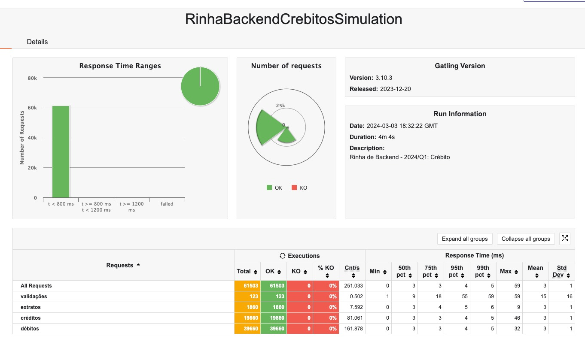

# Rinha de Backend - Segunda Edição

Versão C# da [rinha de backend 2ª edição - 2024/Q1](https://github.com/zanfranceschi/rinha-de-backend-2024-q1). 

Esta versão é uma versão derivada da minha [versão API com cara de API](https://github.com/jonathanperis/rinha2-back-end-bora-dale), agora no modo XGH! :D

## Stack

- aspnet 8.0
- nginx
- postgresql

## Otimizações

- [AOT](https://learn.microsoft.com/en-us/dotnet/core/deploying/native-aot)
- [Trimming](https://learn.microsoft.com/en-us/dotnet/core/deploying/trimming/trimming-options?pivots=dotnet-8-0#trimming-framework-library-features)

## Rodando o projeto

```bash
docker-compose up -d nginx
```

# Resultados

Resultados do Gatling. Todas requisições abaixo de 800ms. (Estes testes utilizaram um máximo de 250MB RAM distribuidos entre os recursos. 60% menos recurso de memória RAM do que o permitido pela rinha!



## Métricas dos testes

Métricas colhidas no Docker Desktop após a execução do teste. O teste foi executado em um Mac Mini M1 16GB RAM/512GB SSD.


